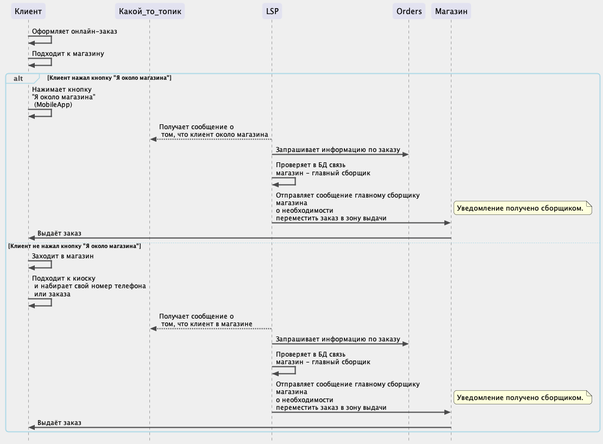

# Отправка уведомлений в Telegram сборщику заказов



**Задача**: необходимо отправлять в telegram-канал сообщение о необходимости переместить заказ в зону выдачи - главному сборщику (конкретного магазина).

После того, как клиент нажал на кнопку "Я около магазина" или после того, как клиент "отметился" в магазине.






<details>

```
@startuml firstDiagram

skinparam maxMessageSize 300
skinparam sequenceArrowThickness 2
skinparam roundcorner 10
skinparam backgroundColor EFEFEF
skinparam style strictuml
skinparam ParticipantBorderColor EFEFEF
skinparam DatabaseBorderColor EFEFEF

skinparam sequence {
ArrowColor 49494A
LifeLineBorderColor 49494A
LifeLineBackgroundColor 49494A
ArrowFontSize 12
GroupBorderColor LightBlue
GroupFontSize 10 
GroupHeaderFontColor 49494A
} 

participant Клиент
participant Какой_то_топик
participant LSP
participant Orders
participant Магазин


Клиент -> Клиент: Оформляет онлайн-заказ
Клиент -> Клиент: Подходит к магазину

alt Клиент нажал кнопку "Я около магазина"
     Клиент -> Клиент: Нажимает кнопку \n"Я около магазина" \n (MobileApp)
     LSP --> Какой_то_топик: Получает сообщение о \n том, что клиент около магазина
     LSP -> Orders: Запрашивает информацию по заказу
     LSP -> LSP: Проверяет в БД связь \nмагазин - главный сборщик
     LSP -> Магазин: Отправляет сообщение главному сборщику магазина \nо необходимости\nпереместить заказ в зону выдачи
     note right: Уведомление получено сборщиком. 
     Магазин -> Клиент: Выдаёт заказ
     deactivate Магазин

else Клиент не нажал кнопку "Я около магазина"
    Клиент -> Клиент: Заходит в магазин
    Клиент -> Клиент: Подходит к киоску\n и набирает свой номер телефона\n или заказа 
    LSP --> Какой_то_топик: Получает сообщение о \n том, что клиент в магазине
    LSP -> Orders: Запрашивает информацию по заказу
    LSP -> LSP: Проверяет в БД связь \nмагазин - главный сборщик
    LSP -> Магазин: Отправляет сообщение главному сборщику магазина \nо необходимости\nпереместить заказ в зону выдачи
    note right: Уведомление получено сборщиком. 
    Магазин -> Клиент: Выдаёт заказ
    deactivate Магазин
    end

@enduml
```

</details>